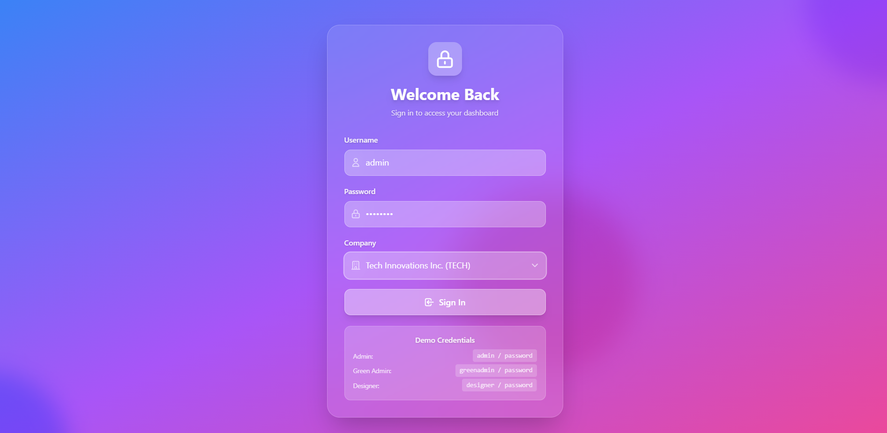
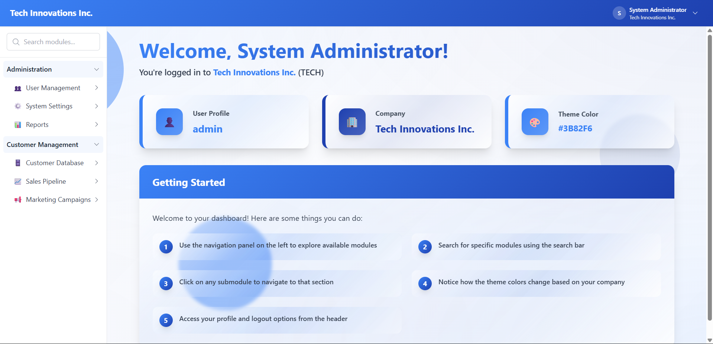
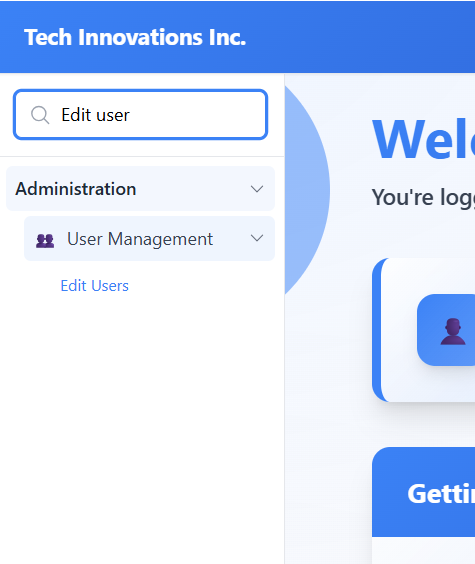
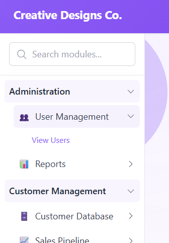
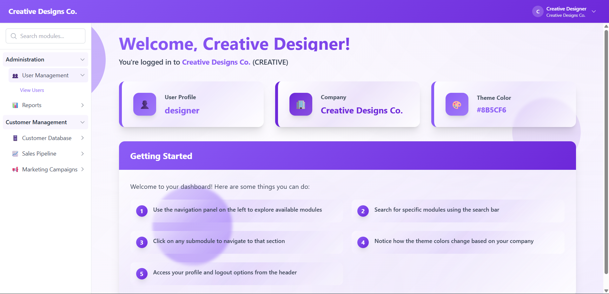

# Laravel 12 + ReactJS Login Application

A containerized authentication system with Laravel 12 backend, ReactJS frontend, PostgreSQL database, and Nginx reverse proxy with HTTPS.

## Features

- 🔐 Laravel Sanctum token-based authentication
- 🎨 Dynamic theming based on selected company
- 🧭 Hierarchical module navigation with search
- 👥 Role-based access control
- 📱 Responsive design with TailwindCSS
- 🐳 Fully containerized with Docker

## Tech Stack

**Backend**: Laravel 12 • PHP 8.3 • PostgreSQL  
**Frontend**: React 18 • TailwindCSS • Axios  
**Infrastructure**: Docker • Nginx • SSL

## Prerequisites

- Docker & Docker Compose
- Composer (for initial Laravel setup)
- Node.js & npm (for initial React setup)
- OpenSSL (for SSL certificates)

## Installation

### 1. Clone Repository

```bash
git clone <repository-url>
cd <repo-path>
```

### 2. Generate SSL Certificates

```bash
chmod +x generate-ssl.sh
./generate-ssl.sh
```

### 3. Backend Setup

```bash
cd backend
composer install
cp .env.example .env
cd ..
```

### 4. Frontend Setup

```bash
cd frontend
npm install
cd ..
```

### 5. Start Services

```bash
docker-compose up -d
```

### 6. Database Migration & Seeding

```bash
# Generate application key
docker-compose exec backend php artisan key:generate

# Run migrations
docker-compose exec backend php artisan migrate

# Seed database with demo data
docker-compose exec backend php artisan db:seed
```

## Access

- **Application**: https://localhost
- **API**: https://localhost/api
- **Database**: localhost:5432

## Demo Credentials

| Username | Password | Company | Access Level |
|----------|----------|---------|--------------|
| `neural_admin` | `quantum2024!` | NeuraLink Technologies | Full access (Super Admin) |
| `quantum_ceo` | `quantum_supremacy` | Quantum Dynamics Corp | Full access (Super Admin) |
| `genesis_cto` | `innovation_2024` | Neural Genesis Labs | Full access (Super Admin) |
| `ai_researcher` | `neural_net_2024` | NeuraLink Technologies | AI/ML Specialist access |
| `ml_engineer` | `deep_learning` | NeuraLink Technologies | AI/ML Specialist access |
| `ethics_lead` | `ai_ethics_2024` | NeuraLink Technologies | Ethics & Compliance access |
| `quantum_physicist` | `entanglement_2024` | Quantum Dynamics Corp | Quantum Computing access |
| `algorithm_dev` | `superposition` | Quantum Dynamics Corp | Quantum Computing access |
| `cloud_architect` | `kubernetes_master` | Infinity Cloud Systems | Cloud Infrastructure access |
| `devops_ninja` | `terraform_deploy` | Infinity Cloud Systems | Cloud Infrastructure access |
| `sre_lead` | `observability_2024` | Infinity Cloud Systems | Cloud Infrastructure access |
| `serverless_dev` | `lambda_functions` | Infinity Cloud Systems | Cloud Infrastructure access |
| `data_scientist` | `big_data_insights` | Neural Genesis Labs | AI/ML Specialist access |
| `research_lead` | `matrix_research` | Neural Genesis Labs | Research & Analytics access |
| `cyber_guardian` | `zero_trust_2024` | Cyber Nexus International | Cybersecurity access |
| `threat_hunter` | `hunt_threats` | Cyber Nexus International | Cybersecurity access |
| `commerce_mgr` | `global_trade_2024` | Cyber Nexus International | Commerce Platform access |
| `forensic_expert` | `digital_evidence` | Cyber Nexus International | Cybersecurity access |
| `crypto_specialist` | `blockchain_secure` | Cyber Nexus International | Commerce & Crypto access |

**Access Level Descriptions:**
- **Super Admin**: Full access to all systems and modules
- **AI/ML Specialist**: Access to neural networks, machine learning, and data analytics
- **Ethics & Compliance**: Access to AI ethics, bias detection, and compliance tools
- **Quantum Computing**: Access to quantum algorithms, simulations, and circuits
- **Cloud Infrastructure**: Access to Kubernetes, serverless, and monitoring tools
- **Research & Analytics**: Access to data lakes, predictive analytics, and research tools
- **Cybersecurity**: Access to threat intelligence, incident response, and zero trust
- **Commerce & Crypto**: Access to marketplace, payments, and cryptocurrency features


## Presentation Notes

### Key Highlights

1. **Authentication Flow**
   - Sanctum token-based authentication
   - Secure HTTP-only cookies
   - Automatic session management

2. **Dynamic Theming**
   - Company-specific colors (primary/accent)
   - Automatic UI theme updates
   - Consistent branding across application

3. **Navigation System**
   - Three-level hierarchy: Systems → Modules → Submodules
   - Real-time search functionality
   - Permission-based access control

4. **Architecture**
   - Microservices approach with Docker
   - Nginx reverse proxy with HTTPS
   - Hot-reloading for development

### Demo Flow

1. **Login** - Show different company themes by switching users



2. **Dashboard** - Navigate through hierarchical modules



3. **Search** - Demonstrate navigation search feature



4. **Permissions** - Compare admin vs. regular user access



5. **Theming** - Switch companies to show dynamic colors



### Database Schema Overview

- **companies** - Organization info with branding
- **users** - User accounts linked to companies
- **systems** - Top-level navigation items
- **modules** - System modules with icons
- **submodules** - Specific functionality
- **user_submodule** - Permission mapping

### API Endpoints

```
GET  /api/companies           - List all companies
POST /api/login               - Authenticate user
POST /api/logout              - End user session
GET  /api/user                - Get current user
GET  /api/navigation          - Get user's navigation tree
GET  /api/navigation/search   - Search navigation items
```

## Development

### View Logs

```bash
docker-compose logs -f backend
docker-compose logs -f frontend
```

### Database Access

```bash
docker-compose exec postgres psql -U laravel -d laravel_login
```

### Rebuild Services

```bash
docker-compose down
docker-compose up -d --build
```

## Troubleshooting

**SSL Certificate Issues**
```bash
rm -rf nginx/ssl/*
./generate-ssl.sh
docker-compose restart nginx
```

**Database Connection Failed**
```bash
docker-compose exec postgres pg_isready -U laravel
```

**Reset Database**
```bash
docker-compose exec backend php artisan migrate:fresh --seed
```
